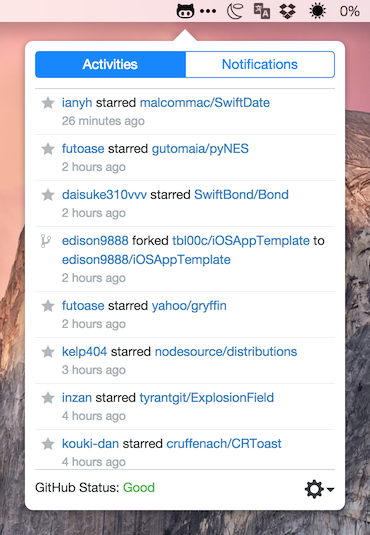

# PopHub

GitHub activity & notification viewer.

## Note

This repository is only for my Election practice and demonstration.  
It's not actively maintained.

You can download the actual app written in Swift from the Mac App Store.
https://itunes.apple.com/jp/app/pophub/id928494006?mt=12

## Requirements

Mac OS X 10.8 or later.

## Installation

### Download

You can download pre-built packages from [releases](https://github.com/questbeat/PopHub/releases) page.

### Build from source

    $ npm install
    $ npm run package

## Customization

This is the state shape of PopHub.

    {
      accessToken: '...',
      user: { login: 'questbeat', ... },
      activePage: 0, // = ActivePage.EVENTS
      eventsUpdateInterval: (1000 * 60 * 10), // 10 min
      notificationsUpdateInterval: (1000 * 60 * 10), // 10 min
      notificationsUpdateInterval: (1000 * 60 * 30), // 30 min
      events: [ ... ],
      fetchingEvents: false,
      notifications: {
        "questbeat/Foo": [ ... ],
        "questbeat/Bar": [ ... ]
      },
      fetchingNotifications: false,
      gitHubStatus: {
        "status": "good",
        "last_updated": "2015-09-15T05:58:44Z"
      }
    }

You can customize the behavior of app by modifying the initial state in `src/renderer/index.js`.  
See the examples below.

### Example: Automatically sign in on launch

    const store = configureStore({
      accessToken: '...', // Write your personal access token
      user: {
        login: 'questbeat'
      }
    });

### Example: Show the "Notifications" tab as default

    const store = configureStore({
      accessToken: '...', // Write your personal access token
      user: {
        login: 'questbeat'
      },
      activePage: 1, // = ActivePage.NOTIFICATIONS
    });

## License

PopHub is released under the MIT license.  
For more information, see LICENSE file in this repository.
